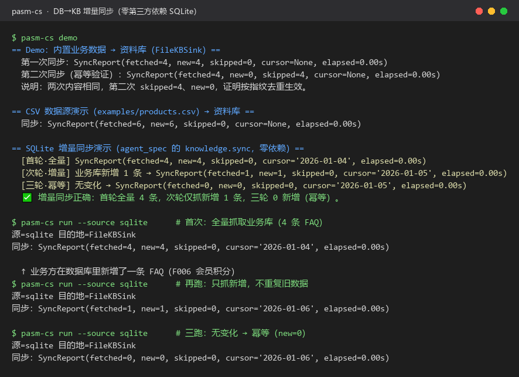
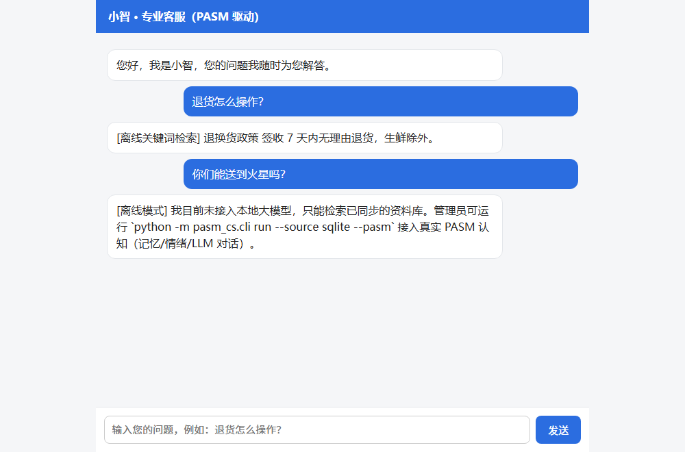
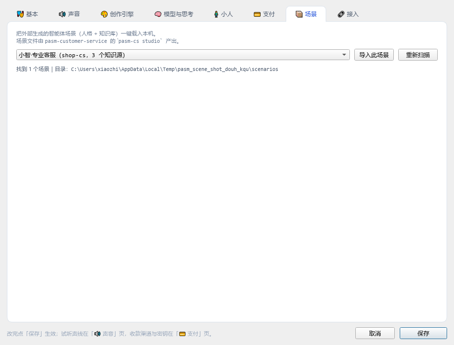

# PASM 专业客服系统

<!-- mcp-name: io.github.arronjack/pasm-customer-service -->
<!-- ↑ 上面这行是官方 MCP Registry 的 PyPI 包所有权校验标记，勿删；
        必须与 server.json 的 name 字段逐字一致。详见 docs/DISTRIBUTION.md -->

基于 PASM 的「有性格、有情绪、有记忆、会成长、能随业务数据自动生长资料库」的
专业客服系统。**一份声明式规格（`agent_spec.toml`），多种运行形态**：

| 形态 | 给谁用 | 入口 |
|---|---|---|
| 本地命令 | 开发者 | `pasm-cs demo / run / serve` |
| **MCP 服务** | WorkBuddy / ClawHub / Claude Desktop / Cursor | `pasm-cs mcp`（stdio，6 个 `cs_*` 工具） |
| **Web 壳** | 完全不懂技术的人（浏览器直接用） | `pasm-cs web` |
| PASM Studio 场景 | 图形界面用户 | `pasm-cs studio` 生成配置 → Studio「📦 场景」页导入 |
| Coze / Character | 平台内重建 | `pasm-cs platform coze` 导出人格+知识 |

> **完整使用手册见 [`docs/USAGE.md`](docs/USAGE.md)**（四种形态逐步上手 + 真实效果截图）；
> **全生态关联图与说明见 [`docs/ECOSYSTEM.md`](docs/ECOSYSTEM.md)**（八仓职责 / 依赖链 / 数据流 / 平台矩阵）；
> **分发渠道与上架操作见 [`docs/DISTRIBUTION.md`](docs/DISTRIBUTION.md)**。

### 真实效果

| CLI（增量同步：全量 → 只抓新增 → 幂等） | Web 壳（浏览器直接对话） | Studio 场景页（一键导入） |
|---|---|---|
|  |  |  |

> 三张图均为**真跑产物**（CLI 截真实终端输出、Web 壳起真 HTTP 服务用 QtWebEngine 渲染、
> Studio 用真 `SettingsDialog` 离屏截图），非示意图。


## 快速开始

```bash
cd pasm-customer-service

# 1) 演示 DB→KB 同步链路（内置数据，证明幂等）
python -m pasm_cs.cli demo

# 2) 校验声明式规格
python -m pasm_cs.cli validate

# 3) 把 CSV 业务数据同步到本地资料库（dry-run，不依赖 pasm）
python -m pasm_cs.cli run --source csv --out examples/kb_demo.jsonl

# 4) 真实增量演示（零依赖 SQLite：首轮全量 → 插入新行 → 次轮只抓增量 → 幂等）
python -m pasm_cs.cli run --source sqlite

# 5) 真实灌入 PASM 资料库（需 pip install pasm-framework）
python -m pasm_cs.cli run --source sqlite --pasm

# 6) 生成 Studio 场景配置 → 在 PASM Studio ≥0.31.2「设置 → 📦 场景」一键导入
#    （目录跟随 PASM_STUDIO_DIR，与 Studio 数据同源；未设则落 %APPDATA%/PASMStudio/scenarios）
python -m pasm_cs.cli studio

# 7) 启动浏览器聊天壳（普通人直接对话，0 依赖；接真 PASM 需 pasm-framework）
python -m pasm_cs.cli web            # 启动 HTTP 服务（默认 :8080）
python -m pasm_cs.cli web --selftest # 仅验证对话逻辑

# 8) 导出各平台配置
python -m pasm_cs.cli platform mcp
python -m pasm_cs.cli platform coze

# 9) 起 MCP 服务（stdio）：WorkBuddy / ClawHub / Claude Desktop 直接调用
python -m pasm_cs.adapters.mcp             # 也可：python -m pasm_cs.cli mcp
python -m pasm_cs.adapters.mcp --selftest  # 自检（含离线降级路径）
```

### 接入 MCP 客户端（WorkBuddy / Claude Desktop / Cursor / ClawHub）

把下面这段放进客户端的 MCP 配置（见 `examples/mcp_clients.json`），平台的大模型即可
通过 `cs_*` 工具调用你本地/云端的 PASM 客服实例——**数据留在你的实例，不上传平台**：

```json
{ "mcpServers": { "pasm-cs": {
    "command": "python", "args": ["-m", "pasm_cs.adapters.mcp"] } } }
```

暴露的工具：`cs_ask`（直接回答）/ `cs_search_kb`（只检索，平台模型组织语言）/
`cs_ingest`（写入知识）/ `cs_sync`（DB→KB 增量同步）/ `cs_persona` / `cs_status`。

## 核心：DB→KB 同步连接器

`pasm_cs/connector.py` 把业务数据（CSV/SQL/REST/内置 Demo）转换成 PASM 资料库条目
`{title, content, source, tags}`，**按内容指纹去重、可断点续传、幂等**。

> ⚠ **`tags` 就是检索面**：框架的资料库插件**只接受 `tags`、会丢掉 `category`**，
> 所以业务表的分类列必须**同时写进 `tag_col`**，否则资料同步进去了却检索不到。
> 标签要写**同义词**（如退货条目写 `退货/换货/售后/退款/生鲜`），用户换个说法才问得出来。

```python
from pasm_cs.connector import DBKBSyncConnector, CsvSource, PasmKBSink
from pasm_cs.cs_agent import build_cs_agent          # ★ 统一入口，别再直连框架 apps/

cs = build_cs_agent("shop-cs", kb_dir="./kb")        # 只需 pip install pasm-framework
conn = DBKBSyncConnector(CsvSource("examples/products.csv"), PasmKBSink(cs),
                         state_path="examples/connector_state.json")
print(conn.sync())   # → SyncReport(new=6, skipped=0)
```

> **为什么用 `pasm_cs.cs_agent` 而不是 `pasm_framework.apps.customer_service`**：
> 框架仓库的 `apps/customer_service.py` 是参考实现，但 `apps/` **未打进 wheel**
> （`packages` 只含 `pasm_framework` + `plugins`），直连那个路径在源码与 `pip install`
> 两种情形下都会 `ModuleNotFoundError`。`build_cs_agent` 会优先用框架参考实现、
> 拿不到时回落到本地等价实现（只依赖已发布的 `BaseApplication` + 内置插件），
> 因此 **`pip install pasm-framework` 装好即可跑**（无引擎时自动降级到 `light` 档，KB/温度/安全仍工作）。

作为 pasm-framework 插件注册（内联即可，无需发包）：

```python
from pasm_cs.plugin import DBKBSyncPlugin
# backend_config={"db_kb_sync": {"enabled": True, "class": DBKBSyncPlugin, "config": {...}}}
```

## 平台分发说明

| 平台 | 直接跑 PASM 认知？ | 方式 |
|---|---|---|
| 本地 / 网页壳 | ✅ | 命令 / `web_run.py`（自带 HTTP 聊天页） |
| PASM Studio | ✅ **已打通并端到端验证**（≥ 0.31.2） | `studio` 命令产出 `scenarios/*.json` → Studio「设置 → 📦 场景」一键导入（人格进「基本」页、知识进资料库） |
| WorkBuddy / ClawHub / Claude / Cursor（MCP） | ✅ **已打通并端到端验证** | `pasm_cs.adapters.mcp`（stdio MCP 服务）暴露 `cs_*` 工具；平台 LLM 调用你的实例，数据留本地 |
| Coze / Character | ⚠️ 转译重建 | `adapters/coze.py` 导出人格+知识配置，在平台内重建（记忆/情绪不互通） |

详见 [`PLAN.md`](./PLAN.md)。
